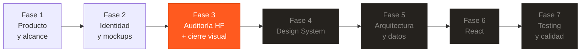
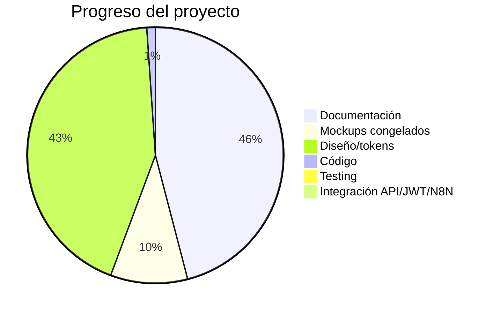

# Auditoría Completa del Repositorio — Vértice CR

> **Fecha:** 2026-09-25 · **Rama:** `Pruebas` · **Commit HEAD:** `968839e`
> **Fase declarada:** 3 — auditoría HF + cierre visual/UX · **React: BLOQUEADO**

---

## 1. Resumen ejecutivo: ¿Dónde estamos?

**Estamos a mitad de la Fase 3.** El proyecto tiene una base documental sólida, identidad visual definida, y tres pantallas HF congeladas. Pero todavía quedan ~12 pantallas HF por cerrar, el cierre transversal de desktop, y todo el trabajo de código por delante.

---

## 2. Estado por capa

### 📐 Documentación (11 docs numerados + extras)

| Documento | Estado | Observación |
|---|---|---|
| AI_CONTEXT.md | ✅ Actualizado | Fuente de verdad global, sincronizado al 25-sep |
| AGENTS.md | ✅ Correcto | Reglas claras y funcionales |
| 00-INDICE-Y-MAPA.md | ✅ Correcto | Mapa limpio y navegable |
| 01-PRODUCTO-Y-ALCANCE.md | ✅ Correcto | Roles, MoSCoW y principios claros |
| 02-NEGOCIO-Y-ESTADOS.md | ✅ Correcto | Ciclo de solicitudes bien documentado |
| 03-UX-Y-FLUJOS.md | ✅ Correcto | Rutas, flujos y estados completos |
| 04-DISENO-VISUAL-Y-ACCESIBILIDAD.md | ✅ Completo | Dark/Light tokens, accesibilidad WCAG, ayuda inline |
| 05-AUDITORIA-HF-Y-MOCKUPS.md | ✅ Detallado | 17 HF listados con estado individual |
| 06-ARQUITECTURA.md | ⚠️ Esqueleto | Estructura objetivo pero sin detalle de contratos |
| 07-DATOS-API-AUTH.md | ⚠️ Pendiente | API externa sin proveedor; JWT sin implementación |
| 08-METRICAS-ADMIN-E-IA.md | ✅ Definido | KPIs, fórmulas y regla de IA documentados |
| 09-TESTING-Y-CALIDAD.md | ⚠️ Declarativo | Orden y casos listados, 0 tests implementados |
| 10-ROADMAP.md | ✅ Actualizado | Secuencia clara, gate de React explícito |

> **Nota:** Existe un documento extra fuera de la numeración: `DECISIONES-HF-POST-AUDITORIA-2026-09-24.md`. Su contenido ya fue absorbido por los documentos numerados, pero referencia archivos que ya no existen (`docs/IDENTITY-ROADMAP.md`, `docs/VISUAL-IDENTITY-WORKING.md`, `docs/fase3_mockups_hf.md`). No es un problema funcional, pero es deuda documental.

---

### 🎨 Mockups / HF (Happy Flows)

| HF | Pantalla | Estado | Archivo/Referencia |
|---|---|---|---|
| 01 | Home | ✅ **CONGELADO** | `mockups/hf-01-home.html` (79 KB, funcional) |
| 02 | Catálogo | ❌ **Pendiente iteración** | Correcciones doc. en 05-AUDITORIA |
| 03 | Detalle producto | 🟡 Mantener + refinar | PNG en HFcompletos |
| 04 | Selección solicitud | 🟢 Mantener | PNG en HFcompletos |
| 05 | Solicitud con archivo | ❌ **Pendiente iteración** | Correcciones doc. en 05-AUDITORIA |
| 06 | Asistencia IA | 🟡 Mantener + refinar | PNG en HFcompletos |
| 07 | Carrito híbrido | ✅ **CONGELADO** | Aprobado 24-sep |
| 08 | Checkout | ✅ **CONGELADO** | Aprobado 25-sep |
| 09 | Seguimiento | 🟢 Mantener | PNG en HFcompletos |
| 10 | Admin Dashboard | ❌ **Simplificar** | Reducir a KPIs reales |
| 11 | Admin productos | ❌ **Ajustar** | — |
| 12 | Login/Registro | ❌ **Ajustar tono** | Eliminar LDAP/GitHub Enterprise |
| 13 | Portal usuario | 🟢 Referencia fuerte | Fuente para QuoteApprovalCard |
| 14 | Menú móvil | ❌ **Rehacer** | Con identidad Vértice |
| 15 | FAQ | 🟡 Refinar | — |
| 16 | About/Contact | 🟡 Revisar | — |
| 17 | Biblioteca CAD | ⚠️ Depende del modelo | — |

**Resumen HF:** 3 congelados / 5 mantener-refinar / 6 requieren trabajo / 3 pendientes de iteración fuerte

---

### 💻 Código fuente (`src/`)

| Aspecto | Estado | Detalle |
|---|---|---|
| Estructura | ⚠️ Scaffold Vite | Solo 4 archivos: `main.jsx`, `App.jsx`, `App.css`, `index.css` |
| Componentes | ❌ Ninguno | No existen componentes, features, pages, hooks ni services |
| Router | ❌ No instalado | `react-router-dom` no está en `package.json` |
| JSON Server | ❌ No instalado | No está en dependencias (aunque `db.json` existe) |
| Recharts | ❌ No instalado | — |
| Jest/Testing Library | ❌ No instalado | — |
| Dependencias | Solo React 19 + Vite 8 | `package.json` tiene lo mínimo del scaffold |

> **Nota:** El código actual en `App.jsx` es un **landing page estático** con datos hardcodeados. **No es una implementación de producción**; es un experimento visual temprano que:
> - Muestra precios en Home (viola la regla de negocio)
> - Usa datos inventados (`3.6k piezas entregadas`, `24/7 soporte técnico`)
> - No tiene Dark/Light, routing, estados ni accesibilidad
> - Los tokens CSS en `index.css` no coinciden con los tokens oficiales de `04-DISENO`

---

### 🗃️ Datos (`db.json`)

| Aspecto | Estado |
|---|---|
| Estructura general | ✅ Consistente con doc 07 |
| Conflictos de merge | ✅ **Resuelto** (ya no hay marcadores `<<<<<<`) |
| Users | ✅ 5 usuarios (1 admin, 4 customers) |
| Products | ✅ 6 productos con campos completos |
| Categories | ✅ 5 categorías |
| Orders | ✅ 8 pedidos en distintos estados |
| OrderItems | ✅ 8 items vinculados correctamente |
| CustomPrintRequests | ✅ 5 solicitudes en distintos estados |
| Reviews, coupons, notifications, activityLog | ⚠️ Arrays vacíos |

> **Importante:** El `db.json` tiene un estado de ciclo parcialmente inconsistente: usa `SUBMITTED` e `IN_REVIEW` en `customPrintRequests`, pero el ciclo documentado en `02-NEGOCIO` empieza con `PENDING_QUOTE`. El campo `settings.customPrintQuoteStatus` dice `"PENDING_QUOTE"` pero ningún registro real usa ese valor. Esto se deberá normalizar antes de React.

---

### 🖼️ Assets

| Tipo | Cantidad | Ubicación |
|---|---|---|
| Favicons | 10 archivos (SVG, PNG multi-size, squircle) | `public/` |
| Logo SVG | 1 (182 KB) | `public/` + `src/assets/` (duplicado) |
| Mockup PNGs (HF originales) | 18 figuras | `mockups/HFcompletos/` |
| Mockup images generadas | 8 carpetas (UXMagic/IA) | `mockups/HFcompletos/` |
| Hero photos | 5 imágenes JPG | `mockups/images/` |
| HF-01 implementado | 1 HTML (80 KB) | `mockups/hf-01-home.html` |
| Referencias | 0 archivos | `referencias/` (vacío) |

---

### 🔀 Git

| Aspecto | Valor |
|---|---|
| Rama activa | `Pruebas` (up to date con origin) |
| Ramas | `Master`, `Pruebas` (activa), `sebas` (remote) |
| Working tree | Limpio |
| Últimos commits | Documentales (cierre HF-01, HF-08) |

---

## 3. Hallazgos e inconsistencias

### 🔴 Problemas

1. **`App.jsx` contradice reglas de negocio**: muestra precios en Home, usa métricas inventadas (`3.6k`, `320+`, `90%`, `24/7`). Esto viola AGENTS.md ("No inventar precios, métricas, endpoints").

2. **Tokens CSS no coinciden con diseño oficial**: `index.css` usa `#0b0d12`, `#ff6a1a`, etc. mientras que `04-DISENO` define `#0D0B09`, `#FF5A1F`. Son paletas distintas. Cuando se empiece React, debe usarse la paleta oficial de doc 04.

3. **`db.json` usa `SUBMITTED` en lugar de `PENDING_QUOTE`**: la solicitud `r5` tiene `status: "SUBMITTED"`, que no existe en el ciclo documentado.

4. **Documento huérfano**: `DECISIONES-HF-POST-AUDITORIA-2026-09-24.md` referencia 3 archivos inexistentes en la sección 15.

5. **`package.json` con `@types/react`**: tiene dependencias de TypeScript (`@types/react`, `@types/react-dom`) a pesar de la regla explícita "JavaScript/JSX; no TypeScript".

### 🟡 Deuda técnica prevista

6. **12 pantallas HF sin congelar**: solo 3/17 están aprobadas.
7. **0 dependencias de producción** más allá de React core: falta router, Recharts, JSON Server, Jest, Testing Library.
8. **0 componentes, 0 tests, 0 services**: todo el código funcional está por escribirse.
9. **API externa sin definir**: no hay proveedor, endpoint ni contrato.
10. **JWT sin definir**: el flujo está descrito conceptualmente pero sin ningún detalle de implementación.

---

## 4. Mapa de progreso global

| Área | Progreso | Nota |
|---|---|---|
| Documentación | ~85% | Sólida; falta cerrar arquitectura detallada y contratos |
| Identidad visual | ~80% | Dark/Light definidos; aplicación pendiente |
| Mockups HF | ~35% | 3/17 congelados; el resto requiere trabajo |
| Código React | ~2% | Solo scaffold de Vite; landing estática descartable |
| Testing | 0% | Ni siquiera Jest está instalado |
| API/JWT/N8N | 0% | Conceptual; sin implementación |

---

## 5. Estado actual y qué sigue

### Dónde estamos
- **Fase 3 en curso**: auditoría HF + cierre visual/UX.
- HF-01, HF-07 y HF-08 están congelados.
- Dark/Light tokens y accesibilidad WCAG están definidos en documentación.
- El código en `src/` es un prototipo temprano que **no debe considerarse base para implementación**.
- React sigue bloqueado por el gate de la documentación.

### Qué se terminó realmente
- ✅ Identidad Obsidian Precision Forge + Lava Orgánica
- ✅ HF-01 Home (HTML verificado en navegador)
- ✅ HF-07 Carrito Híbrido (congelado tras 2 iteraciones)
- ✅ HF-08 Checkout (congelado tras 2 iteraciones)
- ✅ Tokens Dark/Light, reglas de accesibilidad, mecanismo de ayuda
- ✅ Modelo de negocio de solicitudes personalizadas
- ✅ 11 documentos numerados sincronizados

### Qué falta ahora (bloque inmediato)
1. **Iterar HF-02 Catálogo** — correcciones documentadas en 05-AUDITORIA
2. **Iterar HF-05 Solicitud con archivo** — eliminar precios, visor 3D real
3. **Refinar HF-03, HF-06, HF-09, HF-15, HF-16** — ajustes menores
4. **Ajustar HF-10, HF-11, HF-12** — dashboard, productos admin, login
5. **Rehacer HF-14** — menú móvil con identidad Vértice
6. **Resolver HF-17** — depende del modelo de datos final

---

## 6. Siguientes pasos posibles

| # | Opción | Razón |
|---|---|---|
| **A** | **(Recomendado)** Iterar HF-02 + HF-05 en UXMagic y auditar | Son los dos HF pendientes con más correcciones documentadas y son bloqueadores de flujo |
| **B** | Limpiar `App.jsx`/tokens CSS para alinear con doc 04 | Reduce confusión, pero no desbloquea nada mientras React siga bloqueado |
| **C** | Normalizar `db.json` (estados de solicitudes) | Preparación útil para cuando se empiece a consumir datos |
| **D** | Definir API externa + JWT concretamente | Adelanta un bloque que eventualmente es gate de React |

**Recomiendo A** porque es lo que el roadmap marca como siguiente trabajo y es requisito para cerrar desktop y avanzar hacia mobile/tablet → Design System → React.